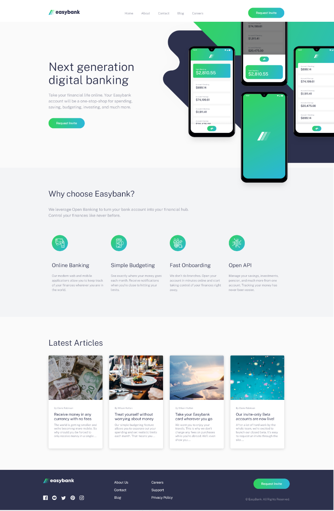

# Frontend Mentor - Easybank landing page solution

This is a solution to the [Easybank landing page challenge on Frontend Mentor](https://www.frontendmentor.io/challenges/easybank-landing-page-WaUhkoDN). Frontend Mentor challenges help you improve your coding skills by building realistic projects. 

## Table of contents

- [Overview](#overview)
  - [The challenge](#the-challenge)
  - [Screenshot](#screenshot)
  - [Links](#links)
- [My process](#my-process)
  - [Built with](#built-with)
  - [What I learned](#what-i-learned)
  - [Useful resources](#useful-resources)
- [Author](#author)
- [Acknowledgments](#acknowledgments)

## Overview

### The challenge

Users should be able to:

- View the optimal layout for the site depending on their device's screen size
- See hover states for all interactive elements on the page

### Screenshot

### Links

- Solution URL: [Solution Available on Github](https://github.com/peirstom/Frontend_Mentor_Easybank_landing_page)
- Live Site URL: [Live Deployment through Netlify](https://musing-darwin-c2ade3.netlify.app/)

## My process

### Built with

- Semantic HTML5 markup
- CSS custom properties
- Flexbox for features
- CSS Grid for articles
- Mobile-first workflow

### What I learned

I used this tutorial by Jessica from coder coder to get into SCSS -> [See youtube](https://www.youtube.com/watch?v=aoQ6S1a32j8)
I did not acomplish this work myself, but followed the tutorial by Jessica to get a better understanding of her workflow, and potentially learn some tips and tricks.

### Useful resources

- [FreeCodeCamp.org Youtube channel](https://www.youtube.com/watch?v=aoQ6S1a32j8) - This was the tutorial from Jessica which developed this landing page step by step, following a top down approach using mobile-first design. 
- [CSS Tricks](https://css-tricks.com/) - I used the gridbox and flexbox tutorials to gain a better understanding of these layout properties.

## Author

- Github - [Tom Peirs](https://github.com/peirstom)
- Frontend Mentor - [@peirstom](https://www.frontendmentor.io/profile/peirstom)
- Twitter - [@tompeirs](https://www.twitter.com/tompeirs)

## Acknowledgments
This was the tutorial from Jessica which developed this landing page step by step, following a top down approach using mobile-first design. 

